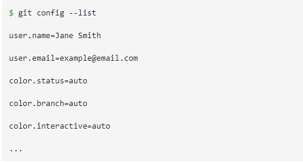

# INTRODUCTION
## Prerequisites
we will first explain various aspects of Version Control
***
## Version Control
* Version Control is a system that allows you to revisit various versions of a file or set of files by recording changes
***
## Local Version Control
* it entails one database on your hard disk that stores changes to files.
## Centralized Version Control
* This system entails a single server storing all changes and file versions, which can be accessed by various clients. 
* it allows programmers to have more knowledge of team members’ activities with certain files, and gave administrators much more control over divvying up revision privileges.
***
## Distributed Version Control
* allows clients to create mirrored repositories.
* programmers working in teams can collaborate with each other in various ways to complete a joint project
***
## So, what is Git?
### Snapshots
* Each time you save a changed version of your project **called commit** Git creates a snapshot of the file and stores a reference to it.
### Local Operations
* eliminating the need to fetch history information from the server, 
### Tracking Changes
* Every single change applied to any file or directory is tracked by Git
### Loss of Data
* Git makes it extremely difficult for a snapshot of your file that is committed to be lost.
### States
* Files in Git can reside in three main states: committed, modified and staged.
### Committed
* Data is securely stored in a local database

### Modified
* File has been changed but not committed to the database
### Staged
* Flagged a file’s changed version to be committed in the next snapshot

***
## History of Git
* Developers of this project began using a DVCS called BitKeeper in 2002
* Since its inception in 2005, Git has become one of the most utilized Version Control Systems in the world.
***
## Getting Started
### Download Git
1. Install as a package
1. Install via another installer
1. Download and compile the source code.

## Mac OS X
### Terminal
* The simplest method for installing Git on a Mac is running Git from the Terminal
### Git Website
* You can also download Git by visiting this link and following the posted directions: [here](http://git-scm.com/download/mac)
### GitHub
* install Git as part of the GitHub for Mac install. [here](http://mac.github.com)
***
## Windows
### Git Website
* You can download Git by visiting this link and following the posted directions: [here](http://git-scm.com/download/win)
### GitHub
* Install Git as part of the GitHub for Windows install. [here](http://windows.github.com)
***
## Linux
### Package Manager
* You can try installing Git via your distribution’s inherent package management tool.
#### For Fedora:
> $ sudo yum install git
#### For Ubuntu
> $ sudo apt-get install git
### Git Website
* To download Git for Linux, visit this link and follow the posted directions:[here](http://git-scm.com/download/linux)
***
### Graphical Clients
* You can access a variety of GUI clients for Mac, Windows, and Linux via the following link:[here](https://git-scm.com/downloads/guis)
### Initial Customization
#### Configuration of Variables
* An inherent Git tool called *git config*
> git config --global user.name "Jane Smith"
> git config --global user.email "example@email.com"
* To confirm
> git config --global user.name (should return Jane Smith)
> git config --global user.email (should return example@email.com)

### Default Text Editor
* type the following into your Terminal or Command Line:
> $ git config --global core.editor emacs
### Check Settings
* To check settings, use the git config --list command.

### Getting Help
* There are three ways to get more information on a particular command, by accessing the manual:
> git help command
> git command --help
> man git-command
***
## Setting up a Git Repository
### Importing 
* To import an existing project or directory into Git, follow these steps using the Terminal or Command Line:
1. Switch to the target project’s directory
Example:
> $ cd test (cd = change directory)
1. Use the git init command
> $ git init
`Note: At this stage, you have created a new subdirectory named .git that has the repository files. Tracking has not commenced.`
1. To start tracking these repository files, perform an initial commit by typing the following:
> $ git add *.c
> $ git add LICENSE
> $ git commit -m “any message here”
* Now, your files are tracked and there’s an initial commit. We will discuss the particular commands in detail soon.

### Cloning
* You can also create a copy of an existing Git repository from a particular server by using the clone command with a repository’s URL:

> $ git clone https://github.com/test

* To clone a repository into a directory with another name of your choosing, use the following command format:

> $ git clone https://github.com/test mydirectory
`The command above makes a copy of the target repository in a directory named “mydirectory.”`
***

## Workflow
### Local Repository Structure
**The local Git repository has three components:**
1. Working Directory: The actual files reside here.
1. Index: The area used for staging
1. Head: Points to the most recent commit

### Saving Changes
#### Tracked
Tracked files can be modified, unmodified, or staged
#### Untracked
Untracked files were not in the last snapshot and do not currently reside in the staging area.
* After cloning a repository, files have tracked status and are unmodified because they have been checked out but not edited.

### The Life Cycle of File Status
1. After you edit a file, Git flags it as modified because of changes made after the previous commit.
1. You stage the modified file.
1. Then, you commit staged changes.

***
### commiting a file 
> $ git commit -m “made change x,y,z”
### commoiting all changes
> $ git commit -a
### Pushing Changes
> $ git push origin master
### Stashing Changes
> $ git stash apply
***
## Remote Repositories
### Seeing Your Remotes
#### git remote command
* git remote command:
can view the `short names`, such as “origin,” of all specified remote handles.
* git remote -v :
can view `all the remote URLs` next to their `corresponding short names`
***
## examples:

