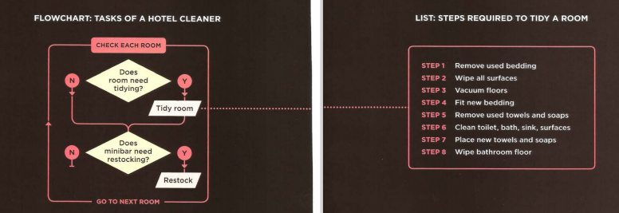
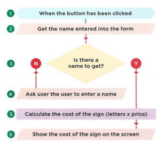
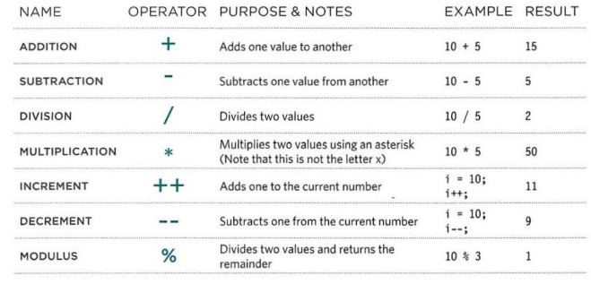
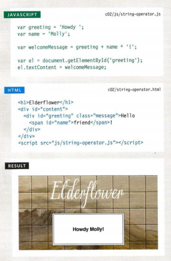
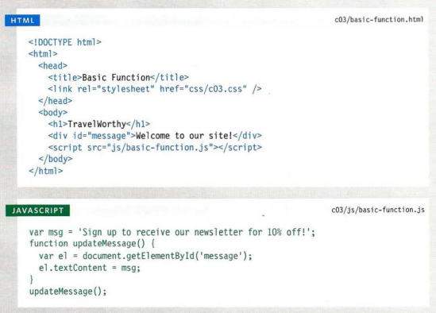
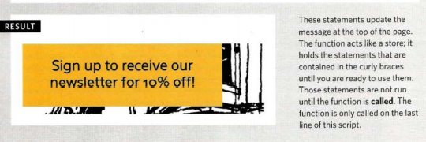
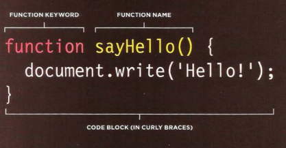
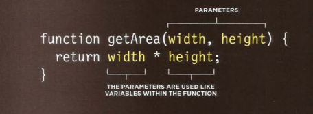
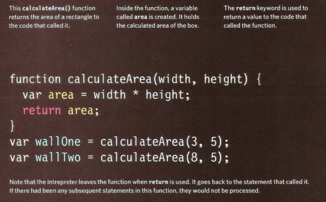

# JAVASCRIPT & JQUERY 
## the ABC of programming 
### what is a script and how do i creat one ?
* A script is a series of instructions that a
computer can follow to achieve a goal
* scripts are made of instructions a computer can follow step by step
* browsers use diffirent parts of the script depending on how the user interacts with the web page.
* scripts can run different sections of the code in response to the situation around them 
#### WRITING ASCRIPT
* To write a script, you need to first state your goal and then list the tasks that need to be completed in order to achieve it
* Start with the big picture of what you want to achieve, and break that down into smaller steps. 
* 1.  DEFINE THE GOAL 
1. DESIGN THE SCRIPT 
1. CODE EACH STEP

#### DEFINING A GOAL & DESIGNING THE SCRIPT
* Consider how you might approach a different type of script.
#### SKETCHING OUT THE TASKS IN A FLOWCHART
* Often scripts will need to perform different tasks in different situations.
* You can use flowcharts to work out how the tasks fit together.
* The flowcharts show the paths between each step. 

## SUMMARY
* A script is a series of instructions that the computer
can follow in order to achieve a goal.
* Each time the script runs, it might only use a subset of
all the instructions.
* Computers approach tasks in a different way than
humans, so your instructions must let the computer
solve the task prggrammatically.
* To approach writing a script, break down your goal into
a series of tasks and then work out each step needed
to complete that task (a flowchart can help)
***

## Expressions 
* An expression evaluates into (results in) a single value. Broadly speaking 
*there are two types of expressions. :
1. EXPRESSIONS THAT JUST ASSIGN A VALUE TO A VARIABLE
> var color = 'beige'; 
1. EXPRESSIONS THAT USE TWO OR MORE VALUES TO RETURN A SINGLE VALUE
> var area = 3 * 2; 
***

## Operators 
* Expressions rely on things called operators; they allow programmers to create a single value from one or more values. 
2. ASSIGNMENT OPERATORS 
> color = 'beige';
2. COMPARISON OPERATORS
> buy = 3 > 5; 
2. ARITHMETIC OPERATORS 
> area = 3 * 2;

2. STRING OPERATORS
> greeting= 'Hi 1 + 'Mol ly';
* There is just one string operator: the+ symbol.
* It is used to join the strings on either side of it
> var firstName = 'Ivy ' ;
> var lastName = ' Stone' ;
> var ful l Name = f irstName + l astName ; 

2. LOGICAL OPERATORS
buy= (5 > 3) && (2 < 4);
***

## Function
### WHAT IS A FUNCTION?
* Functions let you group a series of statements together to perform a specific task. If different parts of a script repeat the same task, you can reuse the function (rather than repeating the same set of statements).
### A BASIC FUNCTION

***
### Declaring a function 
3. declare the function using the function keyword 
3. give it a name 
3. define the statment that perform the task sit in a code block inside curly bracets.

### Calling a function 
* you can excute all the statments between its curly braces with one line only.

### declaring functions that need info
4. declare the function using the function keyword 
4.  give it parameters ( acts like variables inside the function )

### calling functions that need info
* when you call a function that has parameters,specify the values it should use in the parantheses that follow it's name.
* the values are called arguments  and they can be provided as **values** or as **variables**.
### getting a single value out of a function
* some functions return info to the code that called them.

***
THE end ...
