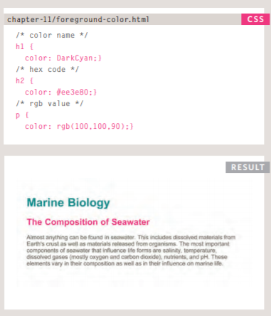
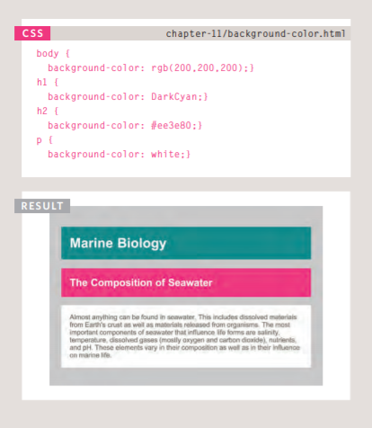
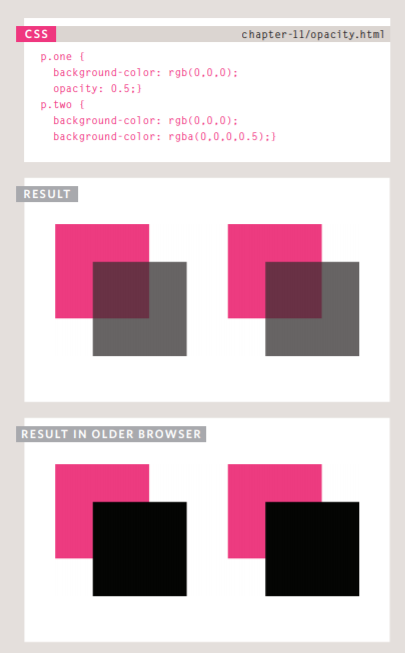

# Color
## Foreground Color
> color
The color property allows you to specify the color of text insidean element. 

You can specify any color in CSS in one of three ways:

* rgb values

* hex codes

* color names

## Background Color
> background-color
background-color property
sets the color of the background
for the box the text or item occupy.

* Every color on a computer screen is created by mixing amounts of red, green,  and blue. To find the color you want, you can use a color picker.

## Contrast
* When picking foreground and background
colors, it is important to ensure that there is enough contrast for the text to be legible.
## Opacity
> opacity
CSS3 introduces the opacity property which allows you to specify the opacity of an element and any of its child elements.
The value is a number between 0.0 and 1.0 (so a value of 0.5 is 50% opacity and 0.15 is 15% opacity)

### HSL Colors
CSS3 introduces an entirely new and intuitive way to specify colors using
* hue

* saturation

* lightness values

## Summary
* COLOR X Color not only brings your site to life, but also helps convey the mood and evokes reactions.
* There are three ways to specify colors in CSS: RGB values, hex codes, and color names.
* Color pickers can help you find the color you want.
* It is important to ensure that there is enough contrast between any text and the background color (otherwise people will not be able to read your content).
* CSS3 has introduced an extra value for RGB colors to indicate opacity. It is known as RGBA.
* CSS3 also allows you to specify colors as HSL values,with an optional opacity value. It is known as HSLA.