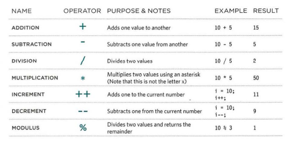

# Duckett HTML book:
## Chapter 2 : Text
### Headings
`<h1> to <h6>`
* HTML has six "levels" of headings:
* `<h1>` is used for main headings
* `<h2>` is used for subheadings
* If there are further sections under the subheadings then the `<h3>` element is used, and so on.
### Paragraphs
`
`
* To create a paragraph, surround
the words that make up the paragraph with an opening `
` tag and closing `
` tag
### Bold & Italic
#### <b>
* By enclosing words in the tags `<b>` and `</b>` we can make characters appear bold.
#### <i>
* By enclosing words in the tags `<b>` and `</b>` we can make
characters appear bold.
#### Superscript & Subscrip
``
* The `` element is used to contain characters that should be superscript such as the suffixes of dates or mathematical concepts like
raising a number to a power such as 2
#### White Space
* In order to make code easier to read, web page authors often add extra spaces or start some elements on new lines.
* When the browser comes across two or more spaces next to each other, it only displays one space.
* Similarly if it comes across a line break, it treats that as a single space too.
this is known as :
> white space collapsing.
#### Line Breaks & Horizontal Rules
` `
*  the browser will automatically show
each new paragraph or heading on a new line. 
* if you wanted to add a line break inside the middle of a paragraph you can
use the line break tag ` `.
`
`
* To create a break between themes — such as a change of topic in a book or a new scene in a play — you can add a
horizontal rule between sections using the `
` tag
#### Visual Editors & Their Code views
* **Visual editors** often resemble word processors. Although each editor will differ slightly, there are some features that
are common to most editors that allow you to control the presentation of text
* **Code views** show you the code created by the visual editor so you can manually edit it, or so
you can just enter new code yourself. It is often activated using a button with an icon that says HTML or has angled brackets. White space may be added to the code by the editor to make the code easier to read.
#### Semantic Markup
There are some text elements that are not  intended to affect the structure of your web pages, but they do add extra information to the pages — they are known as **semantic markup**.
#### Strong & Emphasis
`<strong>` 
* The use of the `<strong>` element indicates that its content has strong importance.
For example, the words contained in this element might be said with strong emphasis.
`<em>`
* The `<em>` element indicates emphasis that subtly changes the meaning of a sentence.
#### Quotations
`<blockquote>`
* The `<blockquote>` element is used for longer quotes that take up an entire paragraph. Note
how the `
` element is still used inside the `<blockquote>` element. 
`<q>`
* The `<q>` element is used for shorter quotes that sit within a paragraph. Browsers are
supposed to put quotes around the `<q>` element,however Internet Explorer does not — therefore many people avoid using the `<q>` element.
#### Abbreviations & Acronyms
`<abbr>` chapter-02/abbreviations.html HTML
* If you use an abbreviation or an acronym, then the `<abbr>` element can be used. A title attribute on the opening tag is used to specify the full term.
#### Citations & Definitions
`<cite>`
When you are referencing a piece of work such as a book, film or research paper, the
`<cite>` element can be used to indicate where the citation is from

`<dfn>`
The first time you explain some new terminology (perhaps an academic concept or some
jargon) in a document, it is known as the **defining instance** of it.
#### Author Details
`<address>`
The `<address>` element has quite a specific use: to contain contact details for the author of the page.

#### Changes to Content
`<ins> , <del>`
* The `<ins>` element can be used to show content that has been inserted into a document, while
the `<del>` element can show text that has been deleted from it.
`<s>`
* The `<s>` element indicates something that is no longer accurate or relevant (but that
should not be deleted). Visually the content of an `<s>` element will usually be displayed with a line through the center.
#### summary 
1. HTML elements are used to describe the structure of the page (e.g. headings, subheadings, paragraphs).
1. They also provide semantic information (e.g. where emphasis should be placed, the definition of any acronyms used, when given text is a quotation).

## Chapter 10: Introducing CSS
### Thinking Inside the Box
* The key to understanding how CSS works is to imagine that there is an invisible box around every HTML element.
* CSS allows you to create rules that control the
way that each individual box (and the contents of that box) is presented.
### CSS Associates Style rules with HTML elements
* CSS works by associating rules with HTML elements. These rules govern how the content of specified elements should be displayed. A CSS rule contains two parts: a selector and a declaration.

### CSS Properties Affect How Elements Are Displayed
* CSS declarations sit inside curly brackets and each is made up of two
parts: a property and a value,separated by a colon. You can specify several properties in one declaration, each separated by a semi-colon. 

### Using Internal CSS
`<style>`
* You can also include CSS rules within an HTML page by placing them inside a `<style> element`, which usually sits inside the `<head>` element of the page
### CSS Selectors
* There are many different types
of CSS selector that allow you to
target rules to specific elements
in an HTML document. 
like : 
1. Universal Selector
1. Type Selector
1. Class Selector
1. ID Selector
1. Child Selector
1. Descendant Selector
1. Adjacent Sibling Selector
1. General Sibling Selector

### Inheritance
If you specify the font-family
or color properties on the `<body>` element, they will apply to most child elements. This is because the value of the font-family property is inherited by child elements. It saves you from having to apply these properties to as many elements (and results in simpler
style sheets).
### Why use External Style Sheets?
1. All of your web pages can share
the same style sheet
1.  If you want to make a
change to how your site appears,
you only need to edit the one
CSS file and all of your pages
will be updated
1. It is generally considered good
practice to have the content of
the site separated from the rules
that determine how it appears.
### summary 
1. CSS treats each HTML element as if it appears inside
its own box and uses rules to indicate how that
element should look.
1. Rules are made up of selectors (that specify the
elements the rule applies to) and declarations (that
indicate what these elements should look like).
1. Different types of selectors allow you to target your
rules at different elements.
1. Declarations are made up of two parts: the properties
of the element that you want to change, and the values
of those properties. For example, the font-family
property sets the choice of font, and the value arial
specifies Arial as the preferred typeface.
1. CSS rules usually appear in a separate document,
although they may appear within an HTML page.

***
the end ..
***
# Duckett JS book:
## Chapter 2: Basic JavaScript instructions
### STATEMENTS
* A script is a series of instructions that a computer can follow one-by-one.
Each individual instruction or step is known as a statement.
* Statements should end with a semicolon. 
### COMMENTS
* You should write comments to explain what your code does.
* They help make your code easier to read and understand.
* This can help you and others who read your code. 
### WHAT IS A VARIABLE?
* A script will have to temporarily
store the bits of information it
needs to do its job. It can store this
data in variables. 
* A variable is a good name for this
concept because the data stored
in a variable can change (or vary)
each time a script runs. 

### Variables : How to declair them 
* before we can use a variable we need to announce that we want to use it .
* we need to creat a variable and name it 

### Variables : How to assign them a value 
* creat a variable 
* store information in it 

### data types 
* JavaScript distinguishes between numbers,
strings, and true or false values known as Booleans
### CHANGING THE VALUE OF A VARIABLE
* Once you have assigned a value
to a variable, you can then
change what is stored in the
variable later in the same script
* Once the variable has been
created, you do not need to
use the var keyword to assign
it a new value. You just use the
variable name, the equals sign
(also known as the assignment
operator), and the new value for
that attribute.
### rules for naming variables 
Here are six rules you must always follow when giving a variable a name:
1. must start with a letter or $ or _ but cant start with a number
1. it can contain letters, $,_ but not - or a .
1. You cannot use keywords or
reserved words
1. All variables are case sensitive
1. Use a name that describes the
kind of information that the
variable stores
1. If your variable name is made
up of more than one word, use a
capital letter for the first letter of
every word after the first word.

### arrays
* An array is a special type of variable. It doesn't
just store one value; it stores a list of values. 
### CREATING AN ARRAY
* You create an array and give it
a name just like you would any
other variable (using the var
keyword followed by the name of
the array). 
* The values are assigned to the
array inside a pair of square
brackets, and each value is
separated by a comma
* values in the array do not need to be the same type 

### VALU ES IN ARRAYS
* Values in an array are accessed as if they are in
a numbered list. It is important to know that the
numbering of this list starts at zero (not one). 
### EXPRESSIONS
* An expression evaluates into (results in) a single value
there are two types of expressions :
1. EXPRESSIONS THAT JUST ASSIGN A
VALUE TO A VARIABLE

1. EXPRESSIONS THAT USE TWO OR
MORE VALUES TO RETURN A
SINGLE VALUE 

### OPERATORS
* Expressions rely on things called operators; they allow programmers to
create a single value from one or more values. 
### ARITHMETI C OPERATORS
* JavaScript contains the following mathematical
operators, which you can use with numbers.
You may remember some from math class

### STRING OPERATOR
There is just one string operator: the+ symbol.
It is used to join the strings on either side of it. 

## Chapter 4: Decisions and Loops
### Decision making 
* There are often several places in a script where decisions are made that determine which lines of code should be run next.

### evaluating condition & conditional statments 
####  evaluating condition
in order to make a decision, the code checks the current status of the script by compairing two values using a comparison operator which returns the value **true** or **false**
#### conditional statments
a conditional statment is based on a concept of  (if, then ,else ), if the condition is true then the code excutes one or more statments ,else the code does somthing different.

### comparison operators : evaluating conditions 
* you can evaluate a situation by comparing **one value** in the script to what you expect it might be.
* the result will be a **boolean** : *true* or *false*
now lets look at those operators:

| operator   |  meaning  | function
:-------------|:-------------| :-------------
|== | equal to  | compares 2 values to see if they are the same
|!= | not equal to  | compares 2 values to see if they are not the same
|===| strict equal to  | compares 2 values to check that both data type and value are the same
|!==| strict not equal to  | compares 2 values to check that both data type and value are not the same
|> | greater than  | checkes if the number on the left is greater than the number on the right
|< | less than  | checkes if the number on the left is less than the number on the right
|>= | greater than or equal to  | checkes if the number on the left is greater than or equal to the number on the right
|<= | less than or equal to  | checkes if the number on the left is less than or equal to the number on the right

***
### structuring comparison operators
* in conditions , there's usually one operator amd two operands 
the operands are places on each side of the operator .
* the operands can be values or variables ,expressioned enclosed in brackets `()`.

### using expressions with comparison operators 
* the operands doesn't have to be a single value or variable name .
* an operand can be an expression

### logical operators
* comparison operators usually return single valuew of *true* or *false*
* they allow you to compare the results of more than one comparison operator

| operator   |  meaning  | number of conditions tested| function
:-------------|:-------------| :-------------|:-------------
|&& | AND  | more than one condition |T+T=T ,T+F=F ,F+T=F ,F+F=F
|  | OR| at least one condition | T+T=T ,T+F=T ,F+T=T ,F+F=F
| ! | NOT | Single boolean value | !T=F , !F=T |

### if statment
* it evaluates a condition 
* if the condition is true 
* subsequent code block are executed

### if .. else statment 
* it evaluates a condition
* if the condition is true
* the first code block is executed
* if the condition is false 
* the second code block is run instead

***
the end ...

