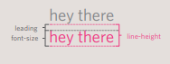
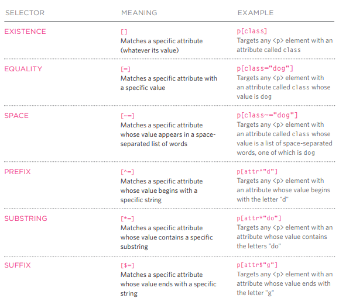

# Duckett HTML book:
## Chapter 5 :Images 
### Choosing Images for Your Site
* images contributes in the general appeal of a website 
* there are companies who sells stock photos for websites to use 
* all images are subject to copy rights 
### Storing Images on Your Site
* it is better to put all images in one folder when building a website 
### Adding Images
` `
this element is used to add an image in a webpage 
* it must contain the following attributes :
1. `src` which is the url or the path of the image 
1. `alt` which is a text description 
1. `title` which provides additional info about the image 
### Height & Width of Images
other attributes can be givin to an image are :
1. `height` 
1. `width`
* images often take time to load , by specifying the size of image it loads faster
### Where to Place Images in Your Code
1. before a paragraph
the paragraph will start in a new line after the image 
1. inside the start of a paragraph
first row of text is aligned with the bottom of the image 
1.  in the middle of a paragraph
The image is placed between the
words of the paragraph that it
appears in.

### Old Code: Aligning Images Horizontally
`align`
this attribute can take up two values :
1. align = right
1. align = left
### Old Code: Aligning Images Vertically
this attribute can take up three values:
1.  align="top" 
1.  align="middle"
1.  align="bottom"
### Three Rules for Creating Images
1. Save images in the right format
1. Save images at the right size
1. Use the correct resolution : most computer screens only show web pages at 72 pixels per inch
### Tools to Edit & Save Images
Adobe Photoshop
### Image Formats: JPEG
Whenever you have many different
colors in a picture you should use a JPEG.
### Image Formats: GIF
Use GIF or PNG format
when saving images
with few colors or large
areas of the same color.
### Image Dimensions
you should save images at the same height and width you want it to be in your webpage 
### Cropping Images
When cropping images it is important not to
lose valuable information
### Image Resolution
Images created for the web should be saved at
a resolution of 72 ppi
### Vector Images
* Vector images are resolution-independent.
* created in programs such as Adobe
Illustrator.
* used by saving a
bitmap version of the original
vector image and using that
### Animated GIFs 
Animated GIFs show several frames of an
image in sequence and therefore can be used to create simple animations
### Transparency
Creating an image that is partially transparent
(or "see-through") for the web involves
selecting one of two formats:
1. transparent gif
1. png
### HTML5: Figure and Figure Caption
`<figure>`
You can have more than one
image inside the  `<figure>`
element as long as they all share
the same caption.
`<figcaption>`
The `<figcaption>` element has
been added to HTML5 in order
to allow web page authors to add
a caption to an image.
## Chapter 11 :Colors
### Foreground Color
`color` color of text inside
an element
* rgb values : expressed as numbers
between 0 and 255.
*  hex codes :hexadecimal code.
* color names 147 predefined colors
*  HSLA in css3
### Background Color
`background-color` sets the color of the background of the box
### Understanding Color 
Every color on a computer screen is created by mixing amounts of red,
green, and blue. To find the color you want, you can use a color picker
### Contrast
* Text is easier to read when
there is higher contrast between
background and foreground
colors.
* too much contrast can
make it harder to read, too
### CSS3: Opacity
`opacity, rgba`
 opacity
property which allows you to
specify the opacity of an element
and any of its child elements.
The value is a number between
0.0 and 1.0
### CSS3: HSL Colors
1. hue :Hue is the colloquial idea of
color
1. saturation :Saturation is the amount of
gray in a color.
1. lightness :Lightness is the amount of
white (lightness) or black
(darkness) in a color
### CSS3: HSL & HSLA
`hsl, hsla`
The value of the property starts
with the letters hsl, followed
by individual values inside
parentheses for:
1. hue
This is expressed as an angle
(between 0 and 360 degrees).
1. saturation
This is expressed as a
percentage.
1. lightness
This is expressed as a
percentage with 0% being white,
50% being normal, and 100%
being black.
1. alpha (transparency)
This is expressed as a
number between 0 and 1.0.
For example, 0.5 represents
50% transparency, and 0.75
represents 75% transparency
> background-color: hsla(0,100%,100%,0.5);}

## Chapter 12:Text 
## Typeface Terminology
* Serif : Serif fonts have extra details on
the ends of the main strokes of
the letters. These details are
known as serifs.
* Sans-Serif : Sans-serif fonts have straight
ends to letters, and therefore
have a much cleaner design.
* Monospace :Every letter in a monospace (or
fixed-width) font is the same
width. (Non-monospace fonts
have different widths.)
* Cursive : Cursive fonts either have
joining strokes or other cursive
characteristics, such as
handwriting styles.
* Fantasy :Fantasy fonts are usually
decorative fonts and are often
used for titles. They're not
designed for long bodies of text.

### Choosing a Typeface for your Website
* When choosing
a typeface, it
is important to
understand that a
browser will usually
only display it if it's
installed on that
user's computer
*  typefaces are subject to copyright, so the
techniques you can choose from are limited by their respective licenses
## Specifying Typefaces
`font-family`
The font-family property
allows you to specify the
typeface that should be used for
any text inside the element(s) to
which a CSS rule applies.
The value of this property is the
name of the typeface you want
to use. 
`font-family: Arial, Verdana, sans-serif;}`
### Size of Type
`font-size`
The font-size property enables
you to specify a size for the
font. There are several ways to
specify the size of a font. The
most common are:
1. pixels : The default size of text in
browsers is 16px
1. percentages out of 16px
1. ems :An em is equivalent to the width
of a letter m.
Setting font size in pixels is the
best way to ensure that the type
appears at the size you intended
### More Font Choice
`@font-face`
@font-face allows you to use
a font, even if it is not installed
on the computer of the person
browsing, by allowing you to
specify a path to a copy of the
font, which will be downloaded if
it is not on the user's machine

`@font-face {font-family:ChunkFiveRegular';src: url('fonts/chunkfive.eot');}`
### Understanding Font Format
Different browsers support
different formats for fonts, so you will need to supply the font in several
variations to reach all browsers.
### Bold
`font-weight`
1. normal
This causes text to appear at a
normal weight.
1. bold
This causes text to appear bold.
### ITALIC
`font-style`
1. normal
This causes text to appear in a
normal style (as opposed to italic
or oblique).
1. Italic
This causes text to appear italic.
1. oblique
This causes text to appear
oblique.
### UpperCase &LowerCase
`text-transform`
1. uppercase
This causes the text to appear
uppercase.
1. lowercase
This causes the text to appear
lowercase.
1. capitalize
This causes the first letter of
each word to appear capitalized
### Underline & Strike
`text-decoration`
1. none
This removes any decoration
already applied to the text.
1. underline
This adds a line underneath the
text.
1. overline
This adds a line over the top of
the text.
1. line-through
This adds a line through words.
1. blink
This animates the text to make it
flash on and off (however this is
generally frowned upon, as it is
considered rather annoying).
### Leading
`line-height`
**Leading** the
vertical space between lines of
text. In a typeface, the part of
a letter that drops beneath the
baseline is called a descender,
while the highest point of a letter
is called the ascender. Leading
is measured from the bottom of
the descender on one line to the
top of the ascender on the next.

`line-height: 1.4em;}`
### Letter & Word Spacing
`letter-spacing` , `word-spacing`
You can
control the space between each
letter with the letter-spacing
property
`letter-spacing: 0.2em;}`
`word-spacing: 1em;}`
### Alignment
`text-align`
1. left
This indicates that the text
should be left-aligned.
1. right
This indicates that the text
should be right-aligned.
1. center
This allows you to center text.
1. justify
This indicates that every line in
a paragraph, except the last line,
should be set to take up the full
width of the containing box.
### Vertical Alignment
`vertical-align`
It is more commonly used with
inline elements such as ,
<em>, or <strong> elements.
When used with these elements,
it performs a task very similar to
the HTML align attribute used
on the  element, which
you met on pages 103-106. The
values it can take are:

1. baseline
1. sub
1. super
1. top
1. text-top
1. middle
1. bottom
1. text-bottom

### Indenting Text
`text-indent`
The text-indent property
allows you to indent the first
line of text within an element.
The amount you want the line
indented by can be specified in
a number of ways but is usually
given in pixels or ems
### CSS3: Drop Shadow
`text-shadow`
It is used to create a drop
shadow, which is a dark version
of the word just behind it and
slightly offset
`text-shadow: -1px -1px #666666;}`
### First Letter or Line
`:first-letter, :first-line`
You can specify different values
for the first letter or first line of
text inside an element using
`:first-letter` and
`:first-line.`
>Technically these are not
properties. They are known as
pseudo-elements
### Styling Links
`:link, :visited`
#### :link
This allows you to set styles
for links that have not yet been
visited.
#### :visited
This allows you to set styles for
links that have been clicked on.
They are commonly used to
control colors of the links and
also whether they are to appear
underlined or not.
### Responding to Users
`:hover, :active, :focus`
1. :hover
This is applied when a user
hovers over an element with a
pointing device such as a mouse. 
1. :active
This is applied when an element
is being activated by a user; for
example, when a button is being
pressed or a link being clicked.
1. :focus
This is applied when an element
has focus

# Blog Post
## JPEG vs PNG vs GIF
* Use JPEG format for all images that contain a natural scene or photograph where variation in colour and intensity is smooth.
* Use PNG format for any image that needs transparency or for images with text & objects with sharp contrast edges like logos.
* Use GIF format for images that contain animations.
### Compression
Compression can be of two types
1. lossless compression

 it is possible to reconstruct the original image from the compressed image because there is no information loss during compression.
 1. lossy compression

  data loss in lossy compression is irreversible

  ### Transparency
  transparency indicates something that is completely invisible
  * JPEG images don’t support transparency .
* PNG images support transparency in two ways (inserting an alpha channel ,or by declaring a single colour as transparent  )
* GIF images support transparency by declaring a single colour in the colour palette as transparent
### Colours
There is a significant difference in the number of colours that can be supported by these 3 formats.
* JPEG images can support around 16 million colours
* PNG images mainly have two modes (PNG8 can support upto 256 colours whereas PNG24 can handle upto 16 million colour)
* GIF images are limited to 256 colours
### Animation
only GIF supports animation. This capability makes GIF format suitable for delivering engaging ads and banners
***
THE END ...