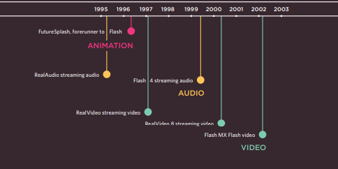
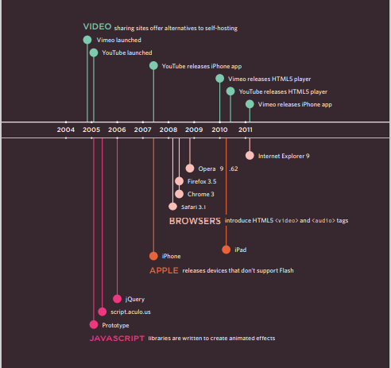

# Duckett HTML book:
# Chapter 16: Images (pp.406-427)
##  controlling the size of images in css 
* You can control the size of an
image using the width and
height properties in CSS, just
like you can for any other box. 
* Specifying image sizes helps
pages to load more smoothly
because the HTML and CSS
code will often load before the
image
## aligning images using css 
1.  The float property is added
to the class that was created to
represent the size of the image
(such as the small class in our
example).
2.  New classes are created with
names such as align-left or
align-right to align the images
to the left or right of the page.
These class names are used in
addition to classes that indicate
the size of the image
## Centering images Using Css
* In order to center an image, it
should be turned into a blocklevel element using the display
property with a value of block
 there are
two common ways in which you
can horizontally center an image:
1.  On the containing element,
you can use the text-align
property with a value of center.
2.  On the image itself, you can
use the use the margin property
and set the values of the left and
right margins to auto
## Background Images
`background-image`
* The background-image
property allows you to place
an image behind any HTML
element. This could be the entire
page or just part of the page. By
default, a background image will
repeat to fill the entire box.
* The path to the image follows
the letters url, and it is put
inside parentheses and quotes
## Repeating Images
### `background-repeat`
* `repeat`
 The background image is
repeated both horizontally and
vertically 
* `repeat-x`
 The image is repeated
horizontally only 
* `repeat-y`
The image is repeated vertically
only.
* `no-repeat`
The image is only shown once.
The background-attachment
property specifies whether a
background image should stay in
one position or move as the user
scrolls up and down the page. It
can have one of two values:
### `background-attachment`
* `fixed`
The background image stays in
the same position on the page.
* `scroll`
The background image moves
up and down as the user scrolls
up and down the page
## Background Position
`background-position`
When an image is not being
repeated, you can use the
background-position
property to specify where in the
browser window the background
image should be placed.
This property usually has a pair
of values. The first represents
the horizontal position and the
second represents the vertical.
*  left top
* left center
*  left bottom
* center top
* center center
* center bottom
*  right top
* right center
* right bottom

## shorthand
`background`
The properties must be specified
in the following order, but you
can miss any value if you do not
want to specify it.
1. background-color
2. background-image
3. background-repeat
4. background-attachment
5. background-position
## image rollovers & sprites
* Using CSS, it is possible to create
a link or button that changes to a
second style when a user moves
their mouse over it (known as a
rollover) and a third style when
they click on it
* This is achieved by setting a
background image for the link or
button that has three different
styles of the same button (but
only allows enough space to
show one of them at a time)
## CSS3: Gradients
`background-image`
* there is the ability to specify a gradient for
the background of a box. The
gradient is created using the
background-image property
and, at the time of writing,
different browsers required a
different syntax.
## Contrast of background images
* If you want to overlay text on a background image, the image must be low
contrast in order for the text to be legible.
# Chapter 19: Practical Information 
## Search Engine Optimization (SEO)
### The Basics
Search engine optimization (or
SEO) is the practice of trying
to help your site appear nearer
the top of search engine results
when people look for the topics
that your website covers
### On-Page Techniques
On-page techniques are the
methods you can use on your
web pages to improve their
rating in search engines.
### Off-Page Techniques
Getting other sites to link to you
is just as important as on-page
techniques. Search engines help
determine how to rank your
site by looking at the number of
other sites that link to yours.
They are particularly interested
in sites whose content is related
to yours
## On-Page SEO
In every page of your website there are seven key places where keywords
(the words people might search on to find your site) can appear in order
to improve its findability
1. Page Title
2.  URL / Web Address
3.  Headings
4. Text
5. Link Text
6. Image Alt Text
7.  Page Descriptions
## How to Identify Keywords and Phrases
Determining which keywords to use on your site can be one of the
hardest tasks when you start to think about SEO
1. Brainstorm
* List down the words that
someone might type into
Google to find your site. Be sure
to include the various topics,
products or services your site is
about.
2. Organize
* Group the keywords into
separate lists for the different
sections or categories of your
website.
3. Research
* There are several tools that let
you enter your keywords and
then they will suggest additional
keywords
4.  Compare
* It is very unlikely that your
site will appear at the top of
the search results for every
keyword. This is especially true
for topics where there is a lot
of competition
5.  Refine
* Now you need to pick which
keywords you will focus on.
These should always be the ones
that are most relevant to each
section of your site.
6.  Map
* Pick 3-5 keywords or phrases
that map to each page of your
website and use these as the
keywords for each page.
## Analytics: Learning about your Visitors
* As soon as people start coming to your site, you can start analyzing
how they found it, what they were looking at and at what point they are
leaving. One of the best tools for doing this is a free service offered by
Google called Google Analytics.
## How Many People Are Coming to Your Site?
* The overview page gives you a snapshot of the key information you are
likely to want to know. In particular, it tells you how many people are
coming to your site.
## What Are Your Visitors Looking At?
* Pages : This tells you which pages your
visitors are looking at the most
and also which pages they are
spending the most time on.
* Landing Pages : These are the pages that people
arrive on when first visiting your
site. This can be particularly
helpful because you may find
people are not always coming
into your site via the homepage.
* Top Exit Pages : This shows which pages people
most commonly leave from. If
a lot of people are leaving from
the same page then you might
consider changing that page or
improving it.
* Bounce Rate : This shows the number of people
who left on the same page that
they arrived on
## Where Are Your  visitors Coming From?
* Referrers : This shows the sites that have
linked to you and the number
of people who have come via
those sites
* Direct: This shows which page a user
arrived on if they did not come
via a link on another site
* Search Terms : This shows the terms users
entered into a search engine
to find your site.
* Advanced Features : We have only scratched the
surface of what you can find
out about your visitors from
Google Analytics
## Domain Name & Hosting 
In order to put your site on the web you will
need a domain name and web hosting.
### DOMAIN NAMES
Your domain name is your web
address
### WEB HOSTING
So that other people can see
your site, you will need to upload
it to a web serve
## FTP & Third Party Tools
* To transfer your code and images from your
computer to your hosting company, you use
something known as File Transfer Protocol.
* Transfer Protocol (or FTP) allows
you to transfer files across the
Internet from your computer to
the web server hosting your site.
* There are a wide variety of sites that offer
services commonly created by web developers
(to save you having to build them yourself).
* Some hosting companies offer
tools to upload files to their
servers using a web browser, but
it is more common to use an FTP
program as they are faster at
transmitting files.
# Chapter 9: Flash, Video & Audio
## How Flash Works
* Since the late 1990s, Flash has been a very
popular tool for creating animations, and later
for playing audio and video in websites.
* If you want to create your
own Flash movie, you need to
purchase the Flash authoring
environment from Adobe
## Use of Flash
* Since 2005, a number of factors have meant
that fewer websites are written in Flash or even
use elements of Flash in their pages.
* When Flash was first released,
it was developed to create
animations. 
* The technology
quickly evolved, however, and
people started to use it to build
media players and even entire
websites.
* Although Flash is still very
popular, in recent years people
have been more selective about
when they use it (and now rarely
consider building an entire
website in Flash).
## Timeline: Flash, VidEo & Audio
* some of the changes in how animation,
video, and audio are created on the web.

